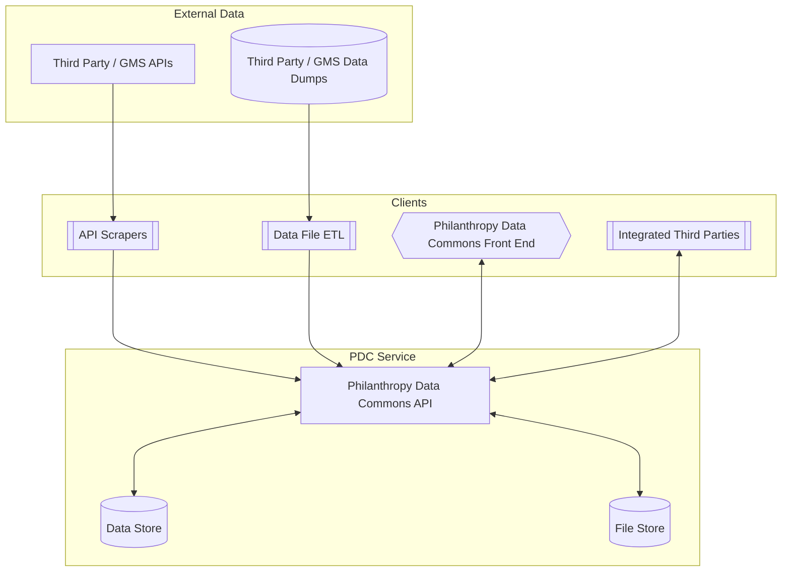
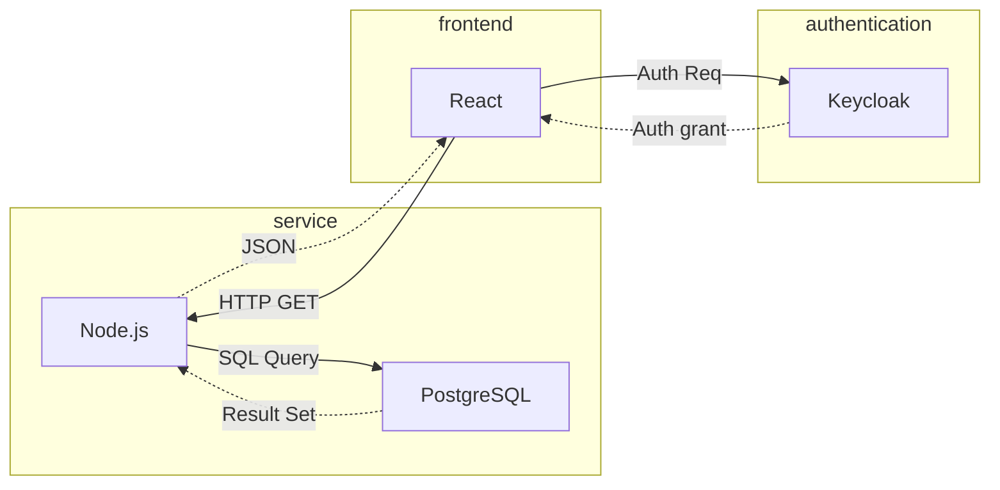

# Architecture

The PDC is built using the following technologies:

| Component | Technology |
|-----------|------------|
| API ([service](https://github.com/PhilanthropyDataCommons/service)) | TypeScript (Node.js) |
| Authentication | [Keycloak](https://github.com/keycloak/keycloak/) |
| SDK Generation ([sdk](https://github.com/PhilanthropyDataCommons/sdk)) | Swagger Codegen |
| Document storage | S3 |
| Data storage | PostgreSQL |
| Client interfaces ([front end](https://github.com/PhilanthropyDataCommons/front-end)) | TypeScript (React) |

The PDC API provides the ability for third parties to read and write data using whatever technology they prefer.

## Diagrams

### Ecosystem Overview

This high level overview shows the general vision for the PDC as well as the types of clients and applications that might exist in the PDC ecosystem.

### Data Flow

